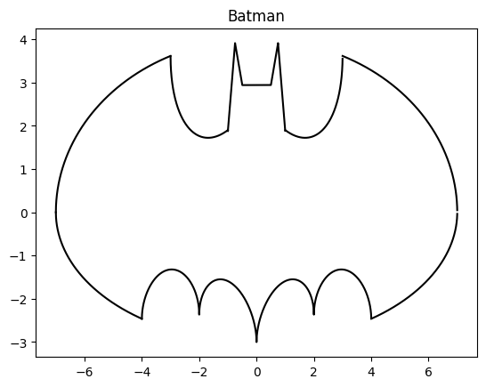

# Batman Curve
 
Graphing the batman curve using matplotlib in Python.




### **Equations**:
1. `2*sqrt((‑abs(abs(x)-1))*abs(3-abs(x))/((abs(x)-1)*(3-abs(x))))*(1+abs(abs(x)-3)/(abs(x)-3))*sqrt(1-(x/7)^2)+(5+0.97*(abs(x-0.5)+abs(x+0.5))-3*(abs(x-0.75)+abs(x+0.75)))*(1+abs(1-abs(x))/(1-abs(x)))`
2. `(‑3)*sqrt(1-(x/7)^2)*sqrt(abs(abs(x)-4)/(abs(x)-4))`
3. `abs(x/2)-0.0913722*x^2-3+sqrt(1-(abs(abs(x)-2)-1)^2)`
4. `(2.71052+1.5-0.5*abs(x)-1.35526*sqrt(4-(abs(x)-1)^2))*sqrt(abs(abs(x)-1)/(abs(x)-1))+0.9`

Paste this into google to see the graph for yourself:

```2 sqrt(-abs(abs(x)-1)abs(3-abs(x))/((abs(x)-1)(3-abs(x))))(1+abs(abs(x)-3)/(abs(x)-3))sqrt(1-(x/7)^2)+(5+0.97(abs(x-.5)+abs(x+.5))-3(abs(x-.75)+abs(x+.75)))(1+abs(1-abs(x))/(1-abs(x))),-3sqrt(1-(x/7)^2)sqrt(abs(abs(x)-4)/(abs(x)-4)),abs(x/2)-0.0913722(x^2)-3+sqrt(1-(abs(abs(x)-2)-1)^2),(2.71052+(1.5-.5abs(x))-1.35526sqrt(4-(abs(x)-1)^2))sqrt(abs(abs(x)-1)/(abs(x)-1))+0.9```